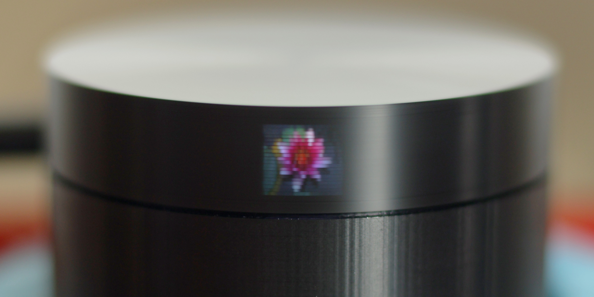
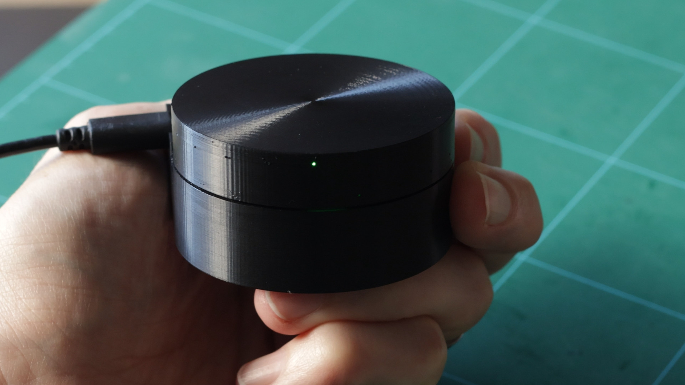
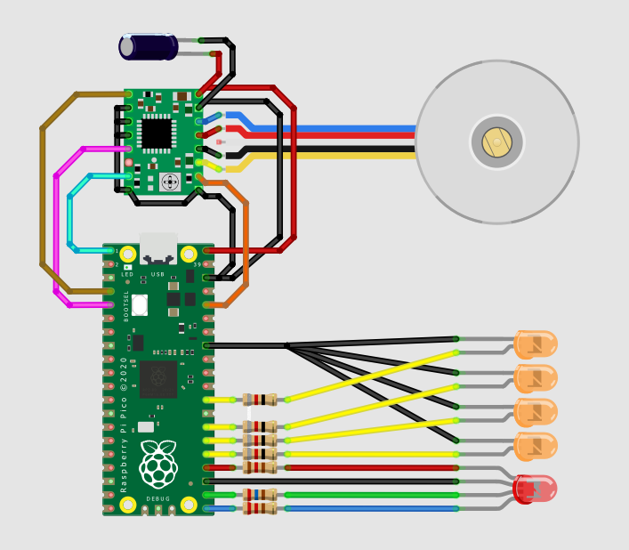
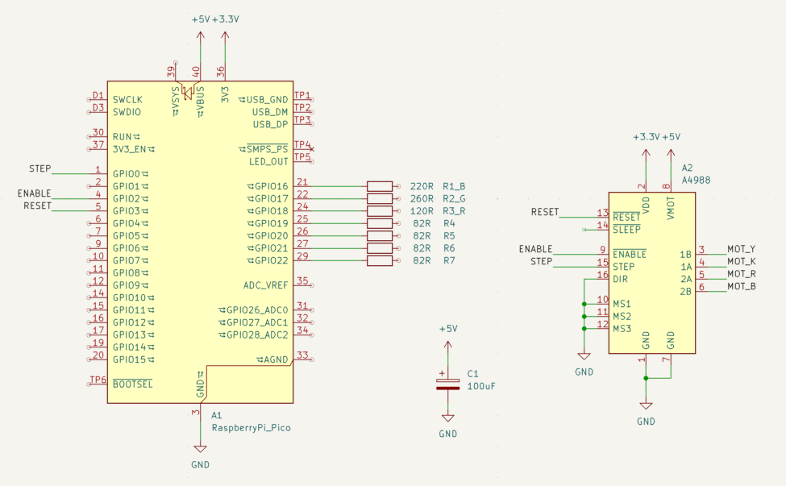

# Scanwheel

Scanwheel is a drum style mechanical television you can build yourself.

It features five windows side by side, each taking advantage of the same scanning drum, but with separate
LEDs to allow separate images. The windows are a luxurious 9mm x 8mm each, with 20 scan lines.

The software uses the Pico's PIO hardware to drive the LEDs, allowing extremely high horizontal resolution,
so the image quality is a lot better than the 20p line count would imply.

There's an accompanying [video](https://example.com/docs) showing the build process, with footage of it in action.

## Parts

You'll need the following components:

`Symbol Technologies 21-02485 stepper motor`
Old but still widely available online. It has an unusual wiring setup, but it can be used as a bipolar
stepper motor by cutting the white wire before it goes into the 4 pin connector as described
[here](https://web.archive.org/web/20100520003941/http://www.picaxe.orconhosting.net.nz/stepdemo.jpg).

`A4988 based StepStick`
Something like the [Pololu 1182](https://www.pololu.com/product/1182). There's a potentiometer to adjust
the current limit. Turn it down as low as it will go before the motor stops turning - it will be almost
at the bottom end of the pot's range.

`100uF Capacitor` Across motor power & ground.

`Raspberry Pi Pico` Doesn't matter which, but use a Pico W if you want to stream wirelessly to the device.

`LEDs` In the design presented here there's a single RGB LED and 4 white LEDs, which seemed like a good
compromise between wiring complexity and image quality.

`Resistors` Each LED needs a current-limiting resistor. The R, G and B channels need to be matched in 
brightness to each other, and the overall RGB brightness needs to be matched to the white LEDs. All of
them together must draw no more than 50mA from the Pico's GPIO pins.

This means you need to determine the resistor values for the specific LEDs you have sourced - measure
the actual current drawn with your LED and resistor connected.

I found that the red channel of the RGB LED was the deciding factor, at 10.75mA with a 120R resistor.
Matching that brightness required 260R for green (2.9mA), 220R for blue (2.8mA) and 82R for white (4.6mA)

## Printing

The 3D models are in the `parts` directory. There are three printed parts; the base, the drum and a lid.

They will fit best if they are scaled to compensate for shrinkage during printing - on my printer,
using PLA, I find that a scale of 100.33% in X and Y and 100% in Z achieves this.

The base and the lid don't need any special treatment, but the drum requires a bit of care in printing.
Use the highest quality settings - small layer height and low speeds - because small flaws in the pinholes
are very visible in the final display.

The sides of the drum are a
single wall thick. In Orca Slicer this means you need to set 'Wall Generator' to 'Arachne'. The infill
should be 100%.

The [OpenSCAD](https://openscad.org/) model for the drum is included, allowing you modify the design.
One of the parameters is nozzle diameter, and if your printer supports a 0.2mm nozzle I recommend using
that variant. You might find you need to fit a washer over the drum's spindle to increase its moment of
inertia.

## Wiring

## Software

The software runs on Micropython 1.28. The device code is in the `pico` directory - `scanwheel.py` is
the driver, along side some example apps.

The code in `host` runs on the PC - `videostream.py` streams videos over a network connection to
`streaming.py` on the device. `pngdirect.py` converts image files to the raw framebuffer format used
by `scanwheel`.
